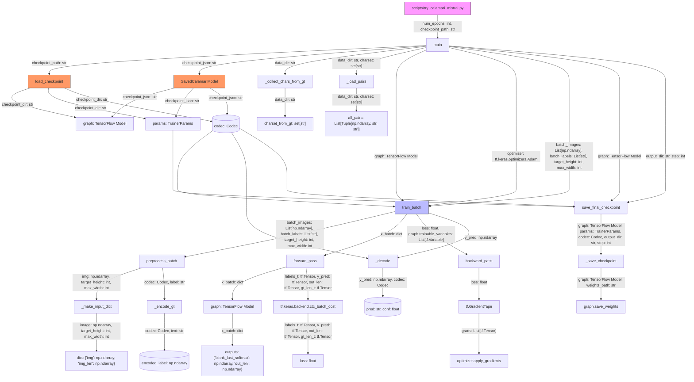

# Mermaid Diagram for `scripts/try_calamari_mistral.py`

## Explanation

### Key Functions and Data Flow

1. **Entry Point**: The script starts in `main()`, which orchestrates the entire training process.

2. **Loading Model and Data**:
   - `load_checkpoint()` or `SavedCalamariModel` loads the model (`graph`), training parameters (`params`), and character codec (`codec`).
   - `_collect_chars_from_gt()` reads ground truth files to extract the character set.
   - `_load_pairs()` loads image and ground truth pairs from the data directory.

3. **Data Structures**:
    - `graph`: The TensorFlow model that performs OCR predictions.
    - `params`: `TrainerParams` object containing training hyperparameters and configuration.
    - `codec`: `Codec` object for encoding/decoding between text and numerical labels, created via `SavedCalamariModel` or `Codec(raw_charset)`.
    - `charset_from_gt`: Set of characters extracted from ground truth files.
    - `all_pairs`: List of tuples containing `(image, gt_text, name)` for training.

4. **Training Loop**:
   - `train_batch()` is the core function that performs the learning/weight updating.
   - It processes batches of images and labels, applies preprocessing, and performs forward and backward passes.

5. **Preprocessing**:
   - `_make_input_dict()` converts raw images into the format expected by the model.
     - Input: `image: np.ndarray`, `target_height: int`, `max_width: int`
     - Output: `dict` with keys `'img'` and `'img_len'`
   - `_encode_gt()` encodes ground truth text into numerical labels using the `codec`.
     - Input: `codec: Codec`, `text: str`
     - Output: `encoded_label: np.ndarray`

6. **Forward Pass**:
   - The `graph` (TensorFlow model) processes the input batch and produces predictions (`y_pred`).
   - CTC (Connectionist Temporal Classification) loss is computed using `tf.keras.backend.ctc_batch_cost`.

7. **Backward Pass**:
   - Gradients are computed using `tf.GradientTape`.
   - The `optimizer` (Adam optimizer) updates the model weights using `apply_gradients()`.

8. **Post-processing**:
   - `_decode()` converts model predictions back into text using the `codec`.
   - Metrics like Character Error Rate (CER) are computed using `_cer()`.

9. **Saving Checkpoints**:
   - `_save_checkpoint()` saves the model weights and training state to disk.
   - This ensures that training can be resumed later if interrupted.

### Classes and Data Structures

- **`graph`**: The TensorFlow model that performs OCR predictions.
- **`optimizer`**: The Adam optimizer responsible for updating model weights.
- **`codec`**: Handles encoding/decoding between text and numerical labels.
- **`TrainerParams`**: Manages training hyperparameters and configuration.
- **`SavedCalamariModel`**: Utility for loading and saving Calamari models.
- **`cv2`**: OpenCV library used for image preprocessing (e.g., resizing, grayscale conversion).

### Summary

The script `scripts/try_calamari_mistral.py` orchestrates the training process by:
1. Loading the model and data.
2. Preprocessing images and labels.
3. Performing forward and backward passes to update weights.
4. Saving checkpoints for resuming training.

The core learning happens in `train_batch()`, where the model processes the data, computes loss, and updates weights using gradient descent.